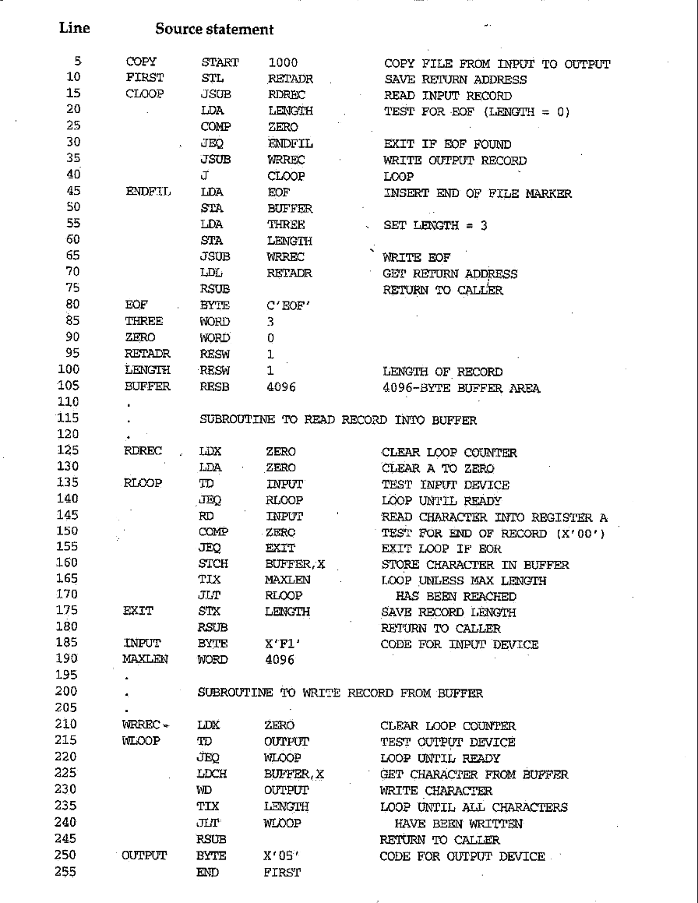

# SIC Machine Architecture

## Specifications

### Memory:

- 8-bit bytes, total 32,768(2^15) bytes.
- A word is formed of any 3 consecutive bytes.
- Addressing is done by:
    - any byte
    - the lowest byte of a word

### Registers:

- Five, A, X, L, PC, SW, (0,1,2,8,9), 24 bits each.

| Mnemonic | Number | Special Use |
|----------|--------|-------------|
| A | 0 | Accumulator; used for arithmetic operations |
| X | 1 | Index register; used for addressing |
| L | 2 | Linkage register; the Jump to Subroutine (JSUB) instruction stores the return address in this register |
| PC | 8 | Program counter: contains the address of the next instruction to be fetched for execution |
| SW | 9 | Status word; contains variety of information, including a Condition Code (CC) |

### Data Formats:

- Integers: 24 bits, 2's complement for negative numbers.
- Characters: 8-bit ASCII codes.

### Instruction Formats:

All machine instructions on SIC have the following 24-bit format:

| 8 | 1 | 15 |
|---|---|----|
| opcode | x | address|

The flag x is used to indicate indexed-addressing mode.

### Addressing Modes

Two addressing modes available, indicated by the setting of the x bit in the
instruction. The following table describes how the target address is calculated
from the address given in the instruction. Parentheses are used to indicate the
contents of a register or a memory location. For example, (X) represents the
contents of register X.

| Mode | Indication | Target address calculator |
|------|------------|---------------------------|
| Direct | x = 0 | TA = address |
| Indexed | x = 1 | T = address + (X) |

### Instruction Set

- P -- Privileged instruction
- C -- Condition code CC set to indicate result of operation (<, =, or >)

| Mnemonic | Format | Opcode | Effect | Notes |
|----------|--------|--------|--------|-------|
| ADD m | 3/4 | 18 | A <- (A) + (m..m + 2) |   |
| AND m | 3/4 | 40 | A <- (A) & (m..m + 2) |   |
| COMP m | 3/4 | 28 | (A) : (m..m + 2) | C |
| DIV m | 3/4 | 24 | A <- (A) / (m..m + 2) |   |
| J m | 3/4 | 3C | PC <- m |   |
| JEQ m | 3/4 | 30 | PC <- m if CC set to = |   |
| JGT m | 3/4 | 34 | PC <- m if CC set to > |   |
| JLT m | 3/4 | 38 | PC <- m if CC set to > |   |
| JSUB m | 3/4 | 48 | L <- (PC); PC <- m |   |
| LDA m | 3/4 | 00 | A <- (m..m + 2) |   |
| LDCH m | 3/4 |50 | A[rightmost byte] <- (m) |   |
| LDL m | 3/4 | 08 | L <- (m..m + 2) |   |
| LDX m | 3/4 | 04 | X <- (m..m + 2) |   |
| MUL m | 3/4 | 20 | A <- (A) * (m..m + 2) |   |
| OR m | 3/4 | 44 | A <- (A) v (m..m + 2) |   |
| RD m | 3/4 | D8 | A[rightmost byte] <- data from device specified by (m) | P |
| RSUB | 3/4 | 4C | PC <- (L) |   |
| STA m | 3/4 | 0C | m..m + 2 <- (A) |   |
| STCH m | 3/4 | 54 | m <- (A)[rightmost byte] |   |
| STL m | 3/4 | 14 | m..m + 2 <- (L) |   |
| STSW m | 3/4 | E8 | m..m + 2 <- (SW) | P |
| STX m | 3/4 | 10 | m..m + 2 <- (X) |   |
| SUB m | 3/4 | 1C | A<- (A) - (m..m + 2) |   |
| TD m | 3/4 | E0 | Test device specified by (m) | P C |
| TIX m | 3/4 | 2C | X <- (X) + 1; (X):(m..m + 2) | C |
| WD m | 3/4 | DC | Device specified by (m) <- (A)[rightmost byte] | P |

### Input and Output

- Each I\O device is assigned a unique 8-bit code.
- All I\O are performed by transferring 1 byte at a time to or from the
rightmost 8 bits of register A.
- Three I\O instructions (each specify the device code as an operand):
    - TD (Test Device) -- check whether device is ready. CC 1 is ready 0 is not.
    - RD (Read Data) -- must wait until the device is ready. TD must be done for
    each byte to be read.
    - WD (Write Data) -- must wait until the device is ready. TD must be done for
    each byte to be written.

